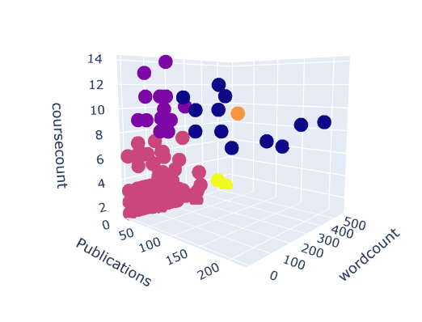
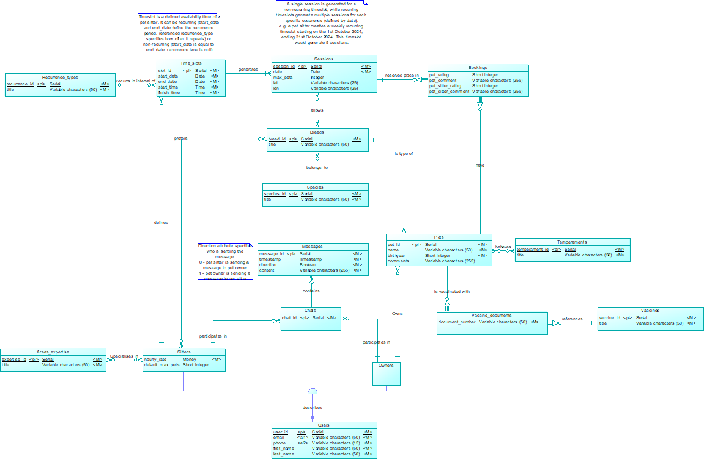

# NOVA IMS Projects Portfolio
This is a repository containing a selection of projects done during my exchange semester at NOVA IMS Information Management School, at Lisbon (2024-2025).

**Keywords**: *Generative Artificial Intelligence, Machine Learning, Data Analysis, Web Scraping, Data Preprocessing, Data Visualization, Databases and SQL, Software Tools for Data Science, Startup Development*

---

| **Course** | **Project** |
|---|---|
| **Capstone Project** | 1. UniMatch, an AI-powered startup |
| **Machine Learning I** | 2. Obesity Prediction with Supervised Modelling |
| **Programming for Data Science** | 3. Web Scraping & Data Analysis for the NOVA IMS Teachers |
| **Data Preprocessing** | 4. Hospital Data Preprocessing, Analysis and Visualization with SQL and SAS |
| **Databases I** | 5. ILovePets Database Design with PowerDesigner and T-SQL |

---

## 1. UniMatch, an AI-powered startup
UniMatch is a start-up meant to showcase the potentialities of generative AI in business problems.

As the main topic, we chose university orientation, as it is one of the biggest problems affecting students, and one of the solutions could be to use generative AI.

The project entailed three main parts: first, we built the database schema and populated the database with synthetic and real data, for testing purposes; then, we built the chatbot with LangChain API, which is able both to handle users' requests and interact with the database; finally, we built a website with Streamlit to deploy the chatbot, incorporating features such as a clean interface, responsive design, and intuitive navigation to ensure a great UX experience.

The project is available in the following **[GitHub repository](https://github.com/OdinMeng/UniMatch)**

  
  

## 2. Obesity Prediction with Supervised Modelling
The Machine Learning I project focused on developing a supervised model for a multi-class classification task: predicting individual obesity levels based on features from a [Kaggle competition dataset](https://www.kaggle.com/competitions/predict-obesity-level).

The dataset included various attributes, such as weight, height, age, gender, and lifestyle-related factors. To address missing data, K-Nearest Neighbors (KNN) was used to impute numerical features, while the Iterative Imputer handled categorical values.

After testing several models, Gradient Boosting proved to be the most effective, achieving an F1-score of approximately 95%. Model performance was rigorously evaluated using Stratified K-Fold Cross-Validation.

## 3. Web Scraping & Data Analysis for the NOVA IMS Teachers
This project showcases Python's capabilities for a Data Science workflow cycle, structured into three main parts: data integration, data wrangling & analysis, and data science in action.

The initial stage focused on extracting datasets using web scraping tools, specifically Selenium and BeautifulSoup. For this project, we extracted a dataset on teachers from the [institutional page of NOVA IMS](https://www.novaims.unl.pt/en/nova-ims/teaching-staff/).

In the second part, we preprocessed the data to clean for analysis, primarily using the Pandas library. Key insights were derived, including the distribution of word counts in teacher profiles, the number of courses taught by each teacher, and the analysis of the number of publications per teacher.

The final stage applied Data Science methods to the dataset. Clustering techniques, including hierarchical clustering and K-means, were implemented using the Scikit-learn library to segment the data. Analysis of the resulting clusters revealed meaningful patterns and insights about the teachers, enabling a better understanding of their profiles and contributions.

## 4. Hospital Data Preprocessing, Analysis and Visualization with SQL and SAS
This project emphasizes the crucial step of data preprocessing within a broader data science workflow. Our goal was to preprocess a transactional table representing the consultations of a hospital, in order to enable the usage of advanced data analytics methods - such as clustering. 

Moreover, we were also tasked with the construction of an Analytic-Base-Table (ABT) from the transactional table, which serves as a consolidated and structured dataset about the patients (or the customer base).

In the end, we made various interactive visualization dashboards, obtaining basic insights about the cleaned datasets. We mainly used software from SAS Studio (SAS Guide and SAS Enterprise Miner) to accomplish data modifications, Power BI to make interactive data visualization panels, and Excel to make specific adjustments, such as changing column names.

# 5. ILovePets Database Design with PowerDesigner and T-SQL
ILovePets is a fictional platform that connects pet owners with pet sitters. Pet sitting consists in taking care of a pet while its owner is away.

We were tasked with developing a SQL database to be implemented with Microsoft SQL software, in two main parts.

The first part involved designing a conceptual database schema to meet business requirements. This included creating an Entity-Relationship model, which was automatically converted into a physical model using PowerDesigner software.

The second part involved creating SQL triggers to meet specific business requirements, such as automatically generating sessions based on a session configuration.

To realize the second part, we also developed scripts for testing purposes, including populating the database and cleaning data and objects.

