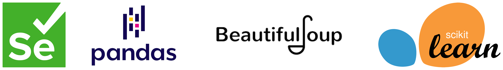

# NOVA IMS Projects Portfolio
This is a repository containing a selection of projects done during my exchange semester at NOVA IMS Information Management School, at Lisbon (2024-2025).

**Keywords**: *Data Science, Machine Learning, Generative AI and LLMS*

---

| **Course** | **Project** |
|---|---|
| **Capstone Project** | 1. UniMatch, an AI-powered startup |
| **Machine Learning I** | 2. Obesity Prediction with Supervised Modelling |
| **Programming for Data Science** | 3. Web Scraping & Data Analysis for the NOVA IMS Teachers |
| **Data Preprocessing** | 4. Hospital Data Preprocessing, Analysis and Visualization with SQL and SAS |

---

## 1. UniMatch, an AI-powered startup
UniMatch is a start-up meant to showcase the potentialities of generative AI in business problems.

As the main topic, we chose university orientation, as it is one of the biggest problems affecting students, and one of the solutions could be to use generative AI.

The project entailed three main parts: first, we built the database schema and populated the database with synthetic and real data; then, we built the chatbot with LangChain API, which is able both to handle users' requests and interact with the database; finally, we built a website with Streamlit to deploy the chatbot, incorporating features such as a clean interface, responsive design, and intuitive navigation to ensure a great UX experience.

Link to the project: TBD

## 2. Obesity Prediction with Supervised Modelling
This project focused on classifying the stages of human obesity based on a variety of features, including weight, height, age, gender, and lifestyle-related factors. To handle missing data, K-Nearest Neighbors (KNN) was used to impute numerical features, while the Iterative Imputer was employed to fill in missing categorical values. Among the models tested, Gradient Boosting emerged as the most accurate, achieving high F1 scores, with performance evaluated using Stratified K-Fold Cross-Validation.

## 3. Web Scraping & Data Analysis for the NOVA IMS Teachers
This project showcases Python's capabilities for a Data Science workflow cycle, structured into three main parts: data integration, data wrangling & analysis, and data science in action.

The initial stage focused on extracting datasets using web scraping tools, specifically Selenium and BeautifulSoup. For this project, we extracted a dataset on teachers from the [institutional page of NOVA IMS](https://www.novaims.unl.pt/en/nova-ims/teaching-staff/).

In the second part, we preprocessed the data to clean for analysis, primarily using the Pandas library. Key insights were derived, including the distribution of word counts in teacher profiles, the number of courses taught by each teacher, and the analysis of the number of publications per teacher.

The final stage applied Data Science methods to the dataset. Clustering techniques, including hierarchical clustering and K-means, were implemented using the Scikit-learn library to segment the data. Analysis of the resulting clusters revealed meaningful patterns and insights about the teachers, enabling a better understanding of their profiles and contributions.

## 4. Hospital Data Preprocessing, Analysis and Visualization with SQL and SAS
This project emphasizes the crucial step of data preprocessing within a broader data science workflow. Our goal was to preprocess a transactional table representing the consultations of a hospital, in order to enable the usage of advanced data analytics methods - such as clustering. 

Moreover, we were also tasked with the construction of an Analytic-Base-Table (ABT) from the transactional table, which serves as a consolidated and structured dataset about the patients (or the customer base).

In the end, we made various interactive visualization dashboards, obtaining basic insights about the cleaned datasets. We mainly used software from SAS Studio (SAS Guide and SAS Enterprise Miner) to accomplish data modifications, Power BI to make interactive data visualization panels, and Excel to make specific adjustments, such as changing column names.

