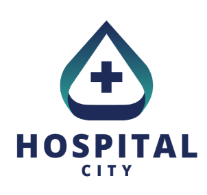

# NOVA IMS Projects Portfolio
This is a repository containing a selection of projects done during my exchange semester at NOVA IMS Information Management School, at Lisbon (2024-2025).

---

| **Course** | **Project** |
|---|---|
| **Capstone Project** | 1. UniMatch, an AI-powered startup |
| **Machine Learning I** | 2. Obesity Prediction with Supervised Modelling |
| **Programming for Data Science** | 3. NOVA IMS Teachers Segmentation with Unsupervised Modelling |
| **Data Preprocessing** | 4. Hospital Data Preprocessing, Analysis and Visualization with SQL and SAS |

---

## 1. UniMatch
TBD

## 2. Obesity Prediction with Supervised Modelling
TBD

## 3. NOVA IMS Teachers Segmentation with Unsupervised Modelling
TBD

## 4. Hospital Data Preprocessing, Analysis and Visualization with SQL and SAS
This project is focused on the data preprocessing part of a data science project. Our goal was to preprocess a transactional table representing the consultations in a hospital, in order to use advanced data analytics methods. Moreover, we were also tasked with the construction of an Analytic-Base-Table (ABT) from the transactional table. In the end, we made various interactive visualization dashboards, obtaining some basic insights about the cleaned datasets. We mainly used software from SAS Studio (SAS Guide and SAS Enterprise Miner) to accomplish data modifications, Power BI to make interactive data visualization panels and Excel to make eventual adjustments to the datasets.

