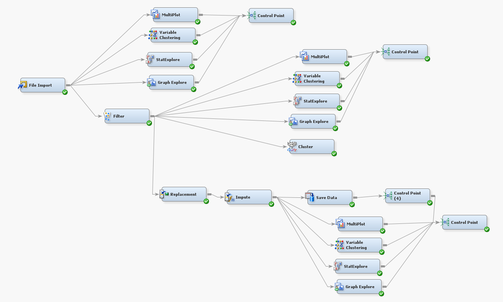
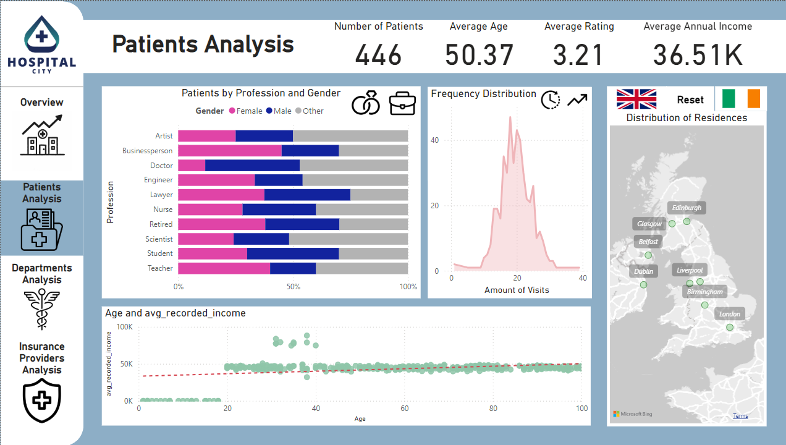

# NOVA IMS Projects Portfolio
This is a repository containing a selection of projects done during my exchange semester at NOVA IMS Information Management School, at Lisbon (2024-2025).

**Keywords**: *Data Science, Machine Learning, Generative AI and LLMS*

---

| **Course** | **Project** |
|---|---|
| **Capstone Project** | 1. UniMatch, an AI-powered startup |
| **Machine Learning I** | 2. Obesity Prediction with Supervised Modelling |
| **Programming for Data Science** | 3. NOVA IMS Teachers Segmentation with Unsupervised Modelling |
| **Data Preprocessing** | 4. Hospital Data Preprocessing, Analysis and Visualization with SQL and SAS |

---

## 1. UniMatch
TBD

## 2. Obesity Prediction with Supervised Modelling
This project focused on classifying the stages of human obesity based on a variety of features, including weight, height, age, gender, and lifestyle-related factors. To handle missing data, K-Nearest Neighbors (KNN) was used to impute numerical features, while the Iterative Imputer was employed to fill in missing categorical values. Among the models tested, Gradient Boosting emerged as the most accurate, achieving high F1 scores, with performance evaluated using Stratified K-Fold Cross-Validation.

## 3. NOVA IMS Teachers Segmentation with Unsupervised Modelling
TBD

## 4. Hospital Data Preprocessing, Analysis and Visualization with SQL and SAS
This project emphasizes the crucial step of data preprocessing within a broader data science workflow. Our goal was to preprocess a transactional table representing the consultations of a hospital, in order to enable the usage of advanced data analytics methods - such as clustering. 

Moreover, we were also tasked with the construction of an Analytic-Base-Table (ABT) from the transactional table, which serves as a consolidated and structured dataset about the patients (or the customer base).

In the end, we made various interactive visualization dashboards, obtaining basic insights about the cleaned datasets. We mainly used software from SAS Studio (SAS Guide and SAS Enterprise Miner) to accomplish data modifications, Power BI to make interactive data visualization panels, and Excel to make specific adjustments, such as changing column names.

